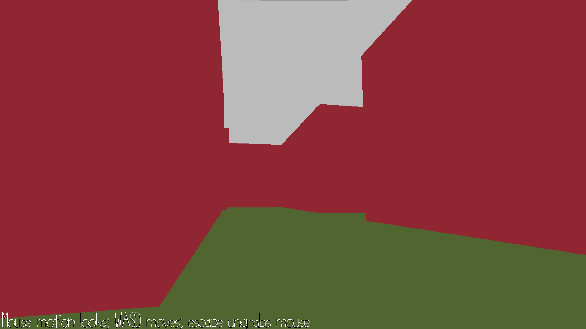

MazeRunner

Author: Mandy Hu

Design: My game is a maze in which players are trapped in the middle, and they 
must try and find their way out of it. The game's difficulty increases as it's
difficult to tell the depth of the walls. (it's not a bug it's a feature)

Screen Shot:

How To Play:

Use WASD to walk, and the mouse to look around. Try to find your way out of the maze
as fast as possible.

Sources: (TODO: list a source URL for any assets you did not create yourself. Make sure you have a license for the asset.)

This game was built with [NEST](NEST.md).

